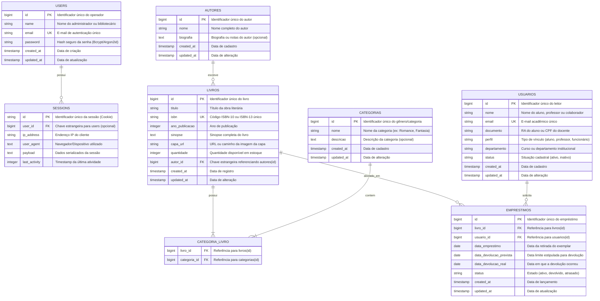

# Diagrama Entidade-Relacionamento (DER)
## Sistema de Gestão de Biblioteca Escolar — FATEC

Este documento formaliza a modelagem de dados do sistema, atendendo ao **Requisito 2 da 1ª Entrega Parcial**, baseado no banco de dados relacional **PostgreSQL 16** e mapeado via **Laravel Eloquent ORM**.

---

## 1. Diagrama Entidade-Relacionamento (Mermaid)

---

## 2. Dicionário de Dados e Relacionamentos

### 2.1 Autores & Livros (1:N)
- Um **Autor** pode escrever múltiplos **Livros** (`hasMany`).
- Cada **Livro** pertence obrigatoriamente a um **Autor** (`belongsTo`).
- **Integridade Referencial**: `ON DELETE CASCADE`.

### 2.2 Livros & Categorias (N:N)
- Um **Livro** pode ter várias **Categorias** (ex: *Ficção Científica*, *Distopia*).
- Uma **Categoria** pode estar associada a múltiplos **Livros**.
- **Tabela Pivot**: `categoria_livro` com chaves estrangeiras compostas e exclusão em cascata.

### 2.3 Usuários, Livros & Empréstimos (1:N)
- Um **Usuário** (aluno/professor) pode realizar múltiplos **Empréstimos**.
- Cada **Empréstimo** está vinculado a um único **Livro** e um único **Usuário**.
- Possui controle temporal com `data_emprestimo`, `data_devolucao_prevista` e `data_devolucao_real`.

### 2.4 Usuários Administrativos & Sessões (1:N)
- A tabela `users` controla o acesso dos operadores do sistema (administradores e bibliotecários).
- A tabela `sessions` armazena as sessões HTTP criptografadas e persistidas no PostgreSQL para controle de autenticação stateful com cookies.

---

## 3. Conformidade com a 3ª Forma Normal (3NF)

1. **1ª Forma Normal (1NF)**: Todos os atributos contêm valores atômicos indivisíveis e não existem grupos repetidores. A relação N:N entre Livros e Categorias foi desacoplada na tabela intermediária `categoria_livro`.
2. **2ª Forma Normal (2NF)**: Todas as tabelas possuem chaves primárias bem definidas (`id`) e nenhum atributo não-chave depende de apenas uma parte de uma chave composta.
3. **3ª Forma Normal (3NF)**: Não existem dependências transitivas. Atributos como nome do autor ou descrição da categoria estão em suas tabelas de origem, evitando redundância e anomalias de atualização no cadastro de livros.
